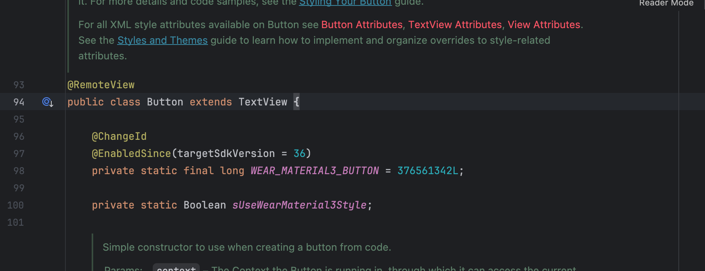

例如 `Button` 的父类就是 `TextView` 

**`TextView`：文本显示控件，基于 `TextView` 还有很多子类，都与 `文本` 处理有关**

```Java
package com.example.testjava1;

import android.graphics.Typeface;
import android.graphics.drawable.Drawable;
import android.os.Bundle;
import android.text.TextUtils;
import android.util.Log;
import android.view.Gravity;
import android.view.View;
import android.widget.TextView;

import androidx.appcompat.app.AppCompatActivity;
import androidx.core.content.ContextCompat;

public class TextViewActivity extends AppCompatActivity {

    private static final String TAG = "TextViewActivity";

    @Override
    protected void onCreate(Bundle savedInstanceState) {
        super.onCreate(savedInstanceState);
        setContentView(R.layout.activity_text_view);
        // 获取颜色值
        int color = ContextCompat.getColor(this, R.color.red);
        // 获取图片
        Drawable drawable = ContextCompat.getDrawable(this, R.drawable.ic_launcher_foreground);
        // 获取当前的节点ID
        TextView textView = findViewById(R.id.hello);

        textView.setOnClickListener(new View.OnClickListener() {
            @Override
            public void onClick(View v) {
                // 设置文本
                textView.setText("Lorem, ipsum dolor sit amet consectetur adipisicing elit. Nam dolor tempore similique aspernatur id accusantium quis beatae soluta sit ab eligendi molestiae dicta, eos, ullam quaerat animi aperiam vel voluptas.");
                // 设置字号
                textView.setTextSize(30f); 
                // 设置文本颜色
                textView.setTextColor(color);
                // 设置文本字体
                textView.setTypeface(Typeface.DEFAULT_BOLD);
                // 设置内容位置
                textView.setGravity(Gravity.BOTTOM | Gravity.END);
                // 设置文本超出限制 这是超出 3 行则隐藏
                textView.setMaxLines(3);
                // 隐藏展示省略号
                textView.setEllipsize(TextUtils.TruncateAt.END);
                // 设置图片
                textView.setCompoundDrawablesWithIntrinsicBounds(drawable, null, null, null);
            }
        });
    }
}
```

```xml
<?xml version="1.0" encoding="utf-8"?>
<LinearLayout xmlns:android="http://schemas.android.com/apk/res/android"
    xmlns:app="http://schemas.android.com/apk/res-auto"
    xmlns:tools="http://schemas.android.com/tools"
    android:id="@+id/main"
    android:layout_width="match_parent"
    android:layout_height="match_parent"
    android:layout_gravity="center"
    android:orientation="vertical"
    tools:context=".TextViewActivity">

    <TextView
        android:id="@+id/hello"
        android:layout_width="200dp"
        android:layout_height="250dp"
        android:background="@color/green"
        android:textSize="20sp"
        android:gravity="center|left"
        android:drawableLeft="@mipmap/ic_launcher_round"
        android:drawablePadding="10dp"
        android:maxLines="2"
        android:ellipsize="end"
        android:textColor="#0000ff"
        android:text="Lorem, ipsum dolor sit amet consectetur adipisicing elit. Nam dolor tempore similique aspernatur id accusantium quis beatae soluta sit ab eligendi molestiae dicta, eos, ullam quaerat animi aperiam vel voluptas." />
</LinearLayout>
```

:::info xml 属性信息

layout_width 宽度设置

layout_height 高度设置

background 背景颜色

textSize 文本尺寸

gravity 内容位置

drawableLeft 图片出现的位置

drawablePadding 图片距离文本的距离

maxLines 文本限制

ellipsize 文本溢出省略号出现位置

textColor 文本颜色

text 文本

:::