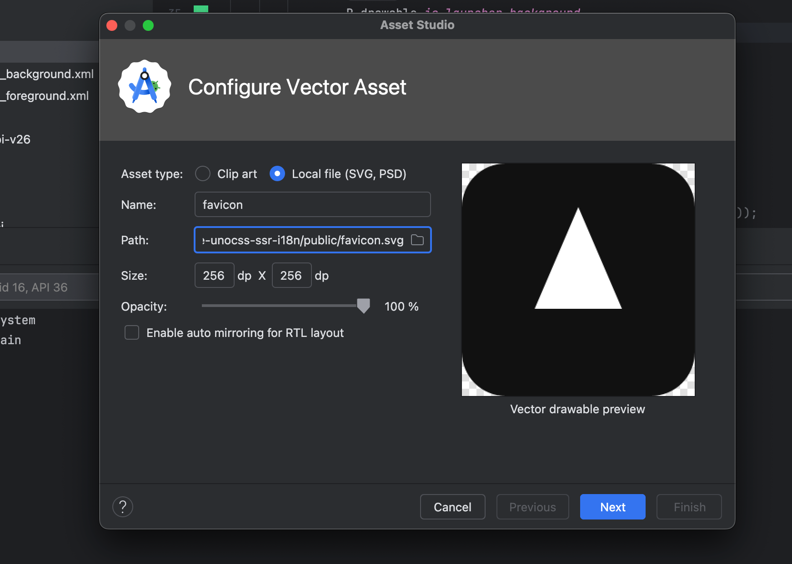

## 

centerCrop：按比例扩大图片，让图片长或宽等于或者大于 ImageView，多余的部分会被裁剪
fitXY：不按比例缩放图片，直至完全填充 ImageView，会导致图片变形

```xml
<?xml version="1.0" encoding="utf-8"?>
<LinearLayout xmlns:android="http://schemas.android.com/apk/res/android"
    xmlns:app="http://schemas.android.com/apk/res-auto"
    xmlns:tools="http://schemas.android.com/tools"
    android:id="@+id/main"
    android:layout_width="match_parent"
    android:layout_height="match_parent"
    android:gravity="center"
    android:orientation="vertical"
    tools:context=".ImageActivity">

    <ImageView
        android:id="@+id/img"
        android:layout_width="match_parent"
        android:layout_height="match_parent"
        android:alpha="0.5"
        android:scaleType="centerCrop"
        android:src="@drawable/ic_launcher_background" />

    <ImageView
        android:id="@+id/icon"
        android:layout_width="wrap_content"
        android:layout_height="wrap_content" />
</LinearLayout>
```

```Java
package com.example.testjava1;

import android.net.Uri;
import android.os.Bundle;
import android.util.Log;
import android.widget.ImageView;

import androidx.appcompat.app.AppCompatActivity;

import java.io.File;

public class ImageActivity extends AppCompatActivity {
    private static final String TAG = "ImageActivity";

    @Override
    protected void onCreate(Bundle savedInstanceState) {
        super.onCreate(savedInstanceState);
        setContentView(R.layout.activity_image);

        ImageView ivTest = findViewById(R.id.img);

        ivTest.setImageResource(R.drawable.ic_launcher_foreground);

        String path = "/data/data/com.example.testjava1/file/8.png";
        Uri uri = Uri.fromFile(new File(path));
        ivTest.setImageURI(uri);

        Log.e(TAG, "onCreate: " + ivTest);
    }
}
```

## bitmap

```Java
package com.example.testjava1;

import android.graphics.Bitmap;
import android.graphics.BitmapFactory;
import android.graphics.drawable.Drawable;
import android.os.Bundle;
import android.util.Log;
import android.widget.ImageView;

import androidx.appcompat.app.AppCompatActivity;
import androidx.core.content.ContextCompat;

import java.io.File;

public class ImageActivity extends AppCompatActivity {
    private static final String TAG = "ImageActivity";

    @Override
    protected void onCreate(Bundle savedInstanceState) {
        super.onCreate(savedInstanceState);
        setContentView(R.layout.activity_image);

        ImageView ivTest = findViewById(R.id.img);

        Drawable drawable = ContextCompat.getDrawable(
                this,
                R.drawable.ic_launcher_background
        );

        Bitmap bitmap = BitmapFactory.decodeResource(getResources(), R.mipmap.check);

        ivTest.setImageBitmap(bitmap);

        Log.e(TAG, "onCreate: " + ivTest);
    }
}
```

:::caution 注意
资源必须是图片格式
:::

```Java
package com.example.testjava1;

import android.graphics.Bitmap;
import android.graphics.BitmapFactory;
import android.graphics.Canvas;
import android.graphics.drawable.Drawable;
import android.net.Uri;
import android.os.Bundle;
import android.util.Log;
import android.widget.ImageView;

import androidx.appcompat.app.AppCompatActivity;
import androidx.core.content.ContextCompat;

import java.io.File;

public class ImageActivity extends AppCompatActivity {
    private static final String TAG = "ImageActivity";

    @Override
    protected void onCreate(Bundle savedInstanceState) {
        super.onCreate(savedInstanceState);
        setContentView(R.layout.activity_image);

        ImageView ivTest = findViewById(R.id.img);

        Drawable drawable = ContextCompat.getDrawable(
                this,
                R.drawable.ic_launcher_background
        );

        Bitmap bitmap = Bitmap.createBitmap(
                drawable.getIntrinsicWidth(),
                drawable.getIntrinsicHeight(),
                Bitmap.Config.ARGB_8888
        );

        Canvas canvas = new Canvas(bitmap);
        drawable.setBounds(0, 0, canvas.getWidth(), canvas.getHeight());
        drawable.draw(canvas);

        ivTest.setImageBitmap(bitmap);

        Log.e(TAG, "onCreate: " + ivTest);
    }
}
```

## 创建SVG图片

