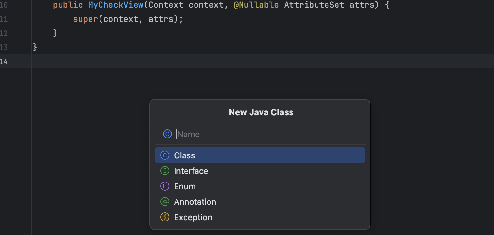
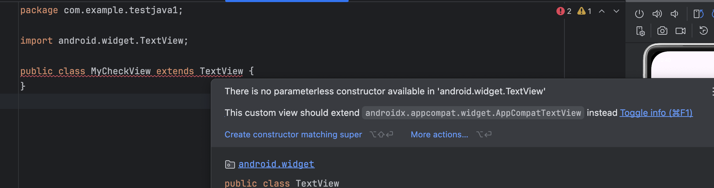
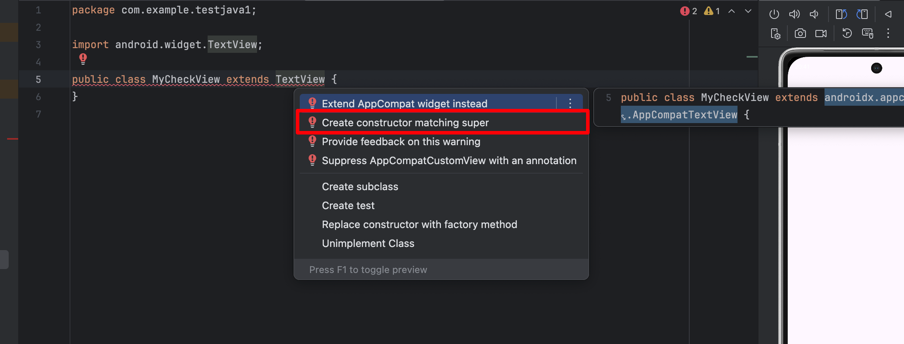
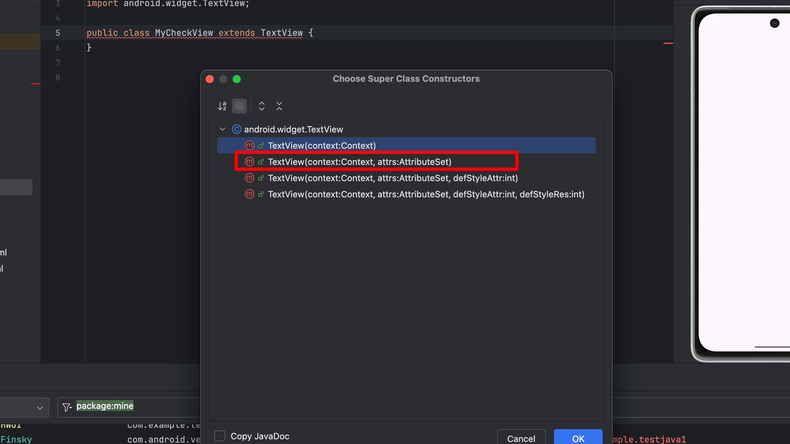
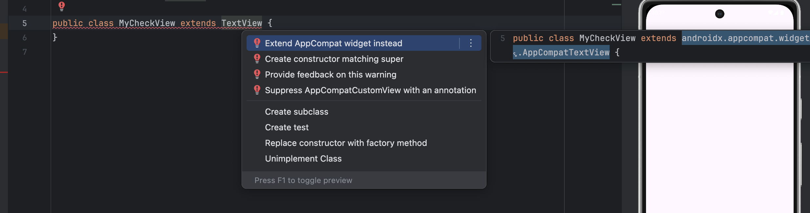
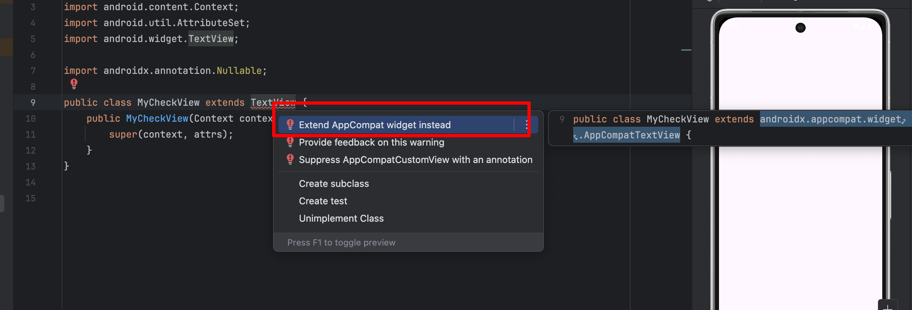

如果希望新建的 `Class` 拥有 `TextView` 所有的方法 可以使用 `extend` 来继承

```Java
package com.example.testjava1;

import android.widget.TextView;

public class MyCheckView extends TextView {
}

```


但是图中会报错



这时候鼠标移到 `TextView` 上，按快捷键 `option + return` 选择第 2 项



继续选择第2项 会变成下面的代码

```Java
package com.example.testjava1;

import android.content.Context;
import android.util.AttributeSet;
import android.widget.TextView;

import androidx.annotation.Nullable;

public class MyCheckView extends TextView {
    public MyCheckView(Context context, @Nullable AttributeSet attrs) {
        super(context, attrs);
    }
}
```

但是上面代码 `TextView` 还是会出现警告，看下图选择第1项即可




```Java
package com.example.testjava1;

import android.content.Context;
import android.util.AttributeSet;
import android.widget.TextView;

import androidx.annotation.Nullable;

public class MyCheckView extends androidx.appcompat.widget.AppCompatTextView {
    public MyCheckView(Context context, @Nullable AttributeSet attrs) {
        super(context, attrs);
    }
}
```

继承之后 就会拥有 `TextView` 所有的功能