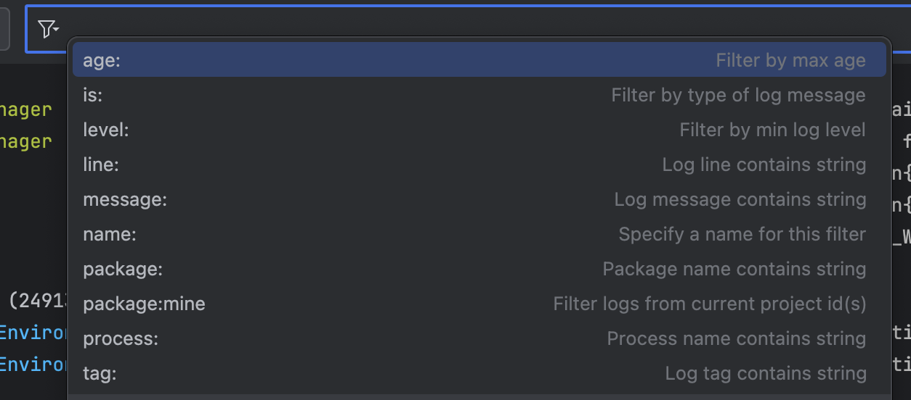
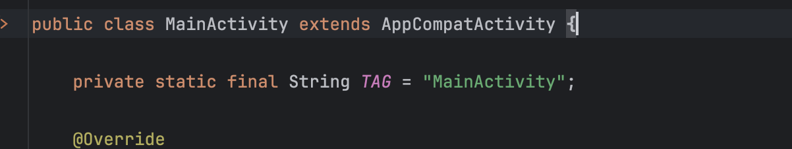
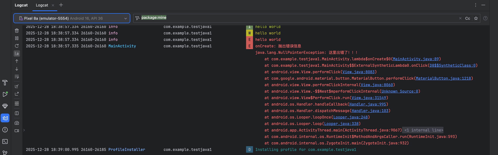

在 `Java` 中我们经常会使用 `System.out.print` 以便于在控制台输出关键信息，
在 `Android` 中我们可以使用功能更丰富的 `Log` 对象调试日志。当程序运行，我们可以在 `logcat` 中查看日志消息。



```bash title="代码提示补齐快捷键 1"
fn + Control + Space
```

# 输出Log

日志一共有 6 种级别：
`VERBOSE` 、`INFO` 、`ASSERT` 、`DEBUG` 、`WARN` 、`ERROR`，
它们在日志窗口显示的样式也略微不同。

```Java
Log.v("VERBOSE","hello world");
Log.d("DEBUG","hello world");
Log.i("INFO","hello world");
Log.w("WARN","hello world");
Log.e("ERROR","hello world");
```

## 添加TAG



:::info 如何添加Tag

1. 在 class 里面输入 `logt` 就会弹出对应的提示 
:::

```bash

Log.e(TAG, "onCreate: ace" );
Log.i(TAG, "onCreate: ace");
```

## logcat 搜索与筛选

手机当中的日志信息量庞大，为了方便我们调试，可以使用一些条件的筛选：

    1. package:mine：筛选包名为当前项目，或者是指定包名

    2. level:error：筛选日志级别为 error

    3. tag:info：筛选 TAG 中包含 “info” 的日志


## 手动抛出异常信息



```Java
Log.e(TAG, "onCreate: 抛出错误信息", new NullPointerException("这里出错了！！！"));
```

:::caution 注意
`new NullPointerException("这里出错了！！！") ` 几乎不被使用！

Log.e(TAG, "onCreate: ace"); 错误信息就放在第二个参数就可以了
:::